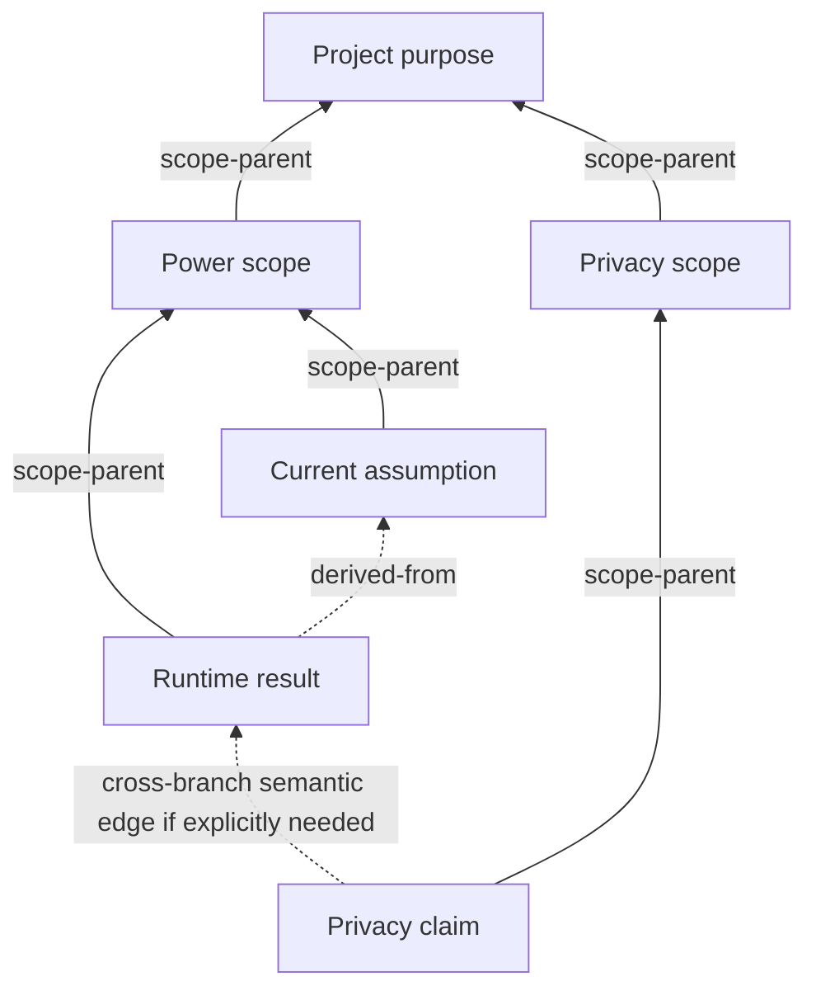

# ValidatedWorld

ValidatedWorld is an experimental **semantic change-control engine for complex
project data**.

A novel, technical design, patent outline, campaign, or game is presented in a
sequence, but its important meaning forms a graph. Conclusions depend on
assumptions and evidence; scenes depend on prior events and character knowledge;
requirements depend on definitions and are realized by decisions and tests.

ValidatedWorld stores that explicit typed property graph in an embedded SQLite
project file. It validates proposed transactions, calculates their downstream
impact, requires selected affected nodes to be reviewed, and commits the complete
new state or nothing at all.

## Storage and protocol

The authoritative workspace is one portable SQLite application file:

```text
project.vw.db
```

That file is a user's mutable project state, not a source-controlled project
template. The repository ignores `.vw.db` files and their SQLite sidecars
outside `tests/`. Samples contain reviewed logical snapshots, transaction scripts,
and expected results, then the app generates disposable databases locally. A binary
database belongs in `tests/` only when a deliberately constructed persistence or
corruption fixture cannot reasonably be generated during the test.

SQLite supplies durable transactions, foreign keys, indexes, and efficient
queries. ValidatedWorld supplies the semantic behavior a database schema cannot:
typed dependency direction, base-plus-projected impact, explainable review
obligations, domain constraints, and proven/disproven/inconclusive outcomes.

JSON remains the public agent and integration protocol. Commands, transaction
operations, diagnostics, impact results, and deterministic logical snapshots are
versioned JSON. The project hash is computed from the logical canonical snapshot,
not from SQLite's physical file bytes.

## The simple mental model

Canonical project content is one graph:

- every authored fact, claim, requirement, character, event, constraint, scope,
  artifact anchor, or other concept is a stable-ID typed **node**;
- every graph-relevant connection is a stable-ID typed **edge** with a source,
  target, optional properties, and declared impact direction;
- exactly one node is the project-purpose root;
- every other node has exactly one `scope-parent` edge, forming a spanning tree;
- all remaining edges form a directed semantic multigraph. An edge may propagate
  impact source-to-target, target-to-source, both ways, or not at all.

That is the public mental model. Schema packages, drafts, validation reports,
reviews, and commits are metadata and ledger records around the graph, not fake
content nodes. SQLite v1 uses nine tables—including migration history—to enforce
stable entity/type identity, edge endpoint foreign keys, and the surrounding
ledger. C# validates node/edge
types, properties, the scope tree, constraints, and transaction policy.

Technical claims, fictional events, character knowledge, and game transitions
are profiles over the same node/edge model. Graph links never hide inside scalar
properties. A higher-arity relationship is represented when needed as a node
connected by ordinary typed edges.



The solid edges form the mandatory tree. The dotted examples are ordinary typed
semantic edges; they may cross tree branches and may be directed or
bidirectional. Thus the database is a graph whose nodes are all organized by one
spanning tree—not merely a tree and not two independently authored graphs.

## Product boundary

ValidatedWorld owns:

- the authoritative `project.vw.db` state;
- a deterministic backend-neutral JSON snapshot representation;
- stable node/edge IDs, logical types, properties, and endpoints;
- structural and semantic validation;
- explained graph impact and mandatory review policy;
- atomic optimistic transactions and replayable commit evidence;
- bounded JSON queries for humans, AIs, and integrations.

ValidatedWorld does **not** own the finished novel, paper, patent application,
manual, source tree, game project, or media. External artifact/anchor nodes may
point to those products, but the engine does not import, rewrite, render, publish,
or certify them.

There is no special diff format. Accepted transaction operations are the direct
change record; impact analysis supplies the transitive consequences.

After Gate A, ValidatedWorld is planned to own one narrowly scoped AI feature:
an optional semantic review of one complete projected transaction. Its single
request contains all selected dependency/impact chains—even when disjoint—and
each included node's singular lineage to the project-purpose root. The
reviewer returns cited concerns and candidate links or operations. It never edits
canon, generates the finished artifact, or turns a model judgment into proof.

## Intended uses

- Technical work: definitions, assumptions, requirements, evidence, decisions,
  conclusions, implementations, verification, and traceability.
- Patent or standards planning: a structured claim/definition/evidence outline
  without claims of legal or scientific correctness.
- Novels and mysteries: canon facts, chronology, character knowledge, clues, and
  disclosure while manuscript text remains external.
- Games and campaigns: a static transition specification whose runtime states
  are derived by a later bounded-analysis profile.

Despite the name, a “world” is any versioned universe of connected nodes.
Fiction is one profile, not the common engine's foundation.

## Planned AI semantic review

The original design's intelligent-review step is still part of the product
direction. It was intentionally moved out of the Gate A implementation so the
database, graph, transaction, and impact guarantees can be proven without a
network, API key, or particular model provider.

If Gate A succeeds, Gate B adds an expensive "lore-team" review. The app first
computes deterministic impact, then makes one request containing the entire
transaction, all selected dependency and impact closures, applicable
constraints, explanation paths, an explicit coverage/omission manifest, and the
singular upward scope lineage for every included node. Disjoint chains remain
together so the reviewer can detect cross-change conflicts. The model can flag
likely missing connections, stale implications, contradictions, terminology
drift, missing qualifications, or insufficient context. Results are structured
`Concern` records with cited entity IDs.

Scope ascent is contextual, not a new impact seed. A leaf change includes its
ancestors but not their other children. Directly changing an intermediate scope
node can affect its descendant subtree. Only directly changing the purpose root
deliberately triggers project-wide review.

A policy may require that review to run and require each concern to be repaired,
rejected with rationale, or acknowledged. The guarantee is that the exact review
workflow occurred and was dispositioned—not that the AI was right. Provider
failure is inconclusive, a paid request is never retried automatically, and
suggestions become canon only through an explicit ValidatedWorld transaction.

Gate B deliberately supports one production path: OpenAI using
`gpt-5.6-terra` with medium reasoning. Tests use a fake client and scripted HTTP,
not alternative providers. Local source development uses .NET Secret Manager;
published processes use `OPENAI_API_KEY`. Before an agent may begin that feature,
the human must personally install the key and explicitly attest readiness as
specified in [Planned AI semantic review](docs/ai_semantic_review.md). The
tracked [`.env.example`](.env.example) lists configuration names, while real
`.env` files remain ignored and are not loaded implicitly. The normal build and
test suite never needs a secret or live API call.

`VW_AIREVIEW__LIVETESTS=true` enables only the separately invoked Gate B live
smoke/evaluation harness; unit and ordinary end-to-end tests always remain
offline. It does not decide whether a user's transaction may skip review.
Gate B project policy declares AI review `disabled`, `optional`, or `required`.
An optional transaction can record an explicit skip with actor and reason; a
required review cannot be bypassed by an environment variable.

## Core workflow

```text
open project.vw.db and verify its logical head hash
→ begin a draft transaction against the exact head revision/hash
→ add, replace, or remove typed nodes and edges
→ construct the projected logical state
→ expand dependency arcs from base and projected typed edges
→ compute explained transitive impact
→ repair graph data and disposition policy-selected affected nodes
→ run complete deterministic validation
→ optionally run required AI semantic review and disposition its concerns [Gate B]
→ commit all relational changes atomically or roll back everything
→ return versioned JSON results
```

## Authoring without edge-entry drudgery

The stored graph stays fully explicit, but input need not be repetitive. Planned
transaction authoring supports a focus node and batches:

- new nodes in a batch may inherit the chosen focus as their `scope-parent`;
- a cluster is simply a normal scope node created with its children in one batch;
- explicitly selected profile helpers may expand common patterns into nodes and
  semantic edges;
- the app returns the fully expanded operation list before validation or commit.

Only the scope-parent convenience is automatic. Semantic dependency edges are
never guessed silently. This keeps the canonical graph inspectable while letting
an agent work within one local branch of the project at a time.

## Start here

- [Feasibility and limits](docs/feasibility.md) — guarantee boundary and proof
  gates.
- [Product and architecture specification](docs/validated_world_authoring_spec.md)
  — authoritative graph model, persistence, and profile design.
- [Implementation blueprint](docs/implementation_blueprint.md) — exact storage
  schema, algorithms, tests, and work packages.
- [Planned AI semantic review](docs/ai_semantic_review.md) — post-Gate-A review
  whole-transaction request, scope, concerns, secrets, and evaluation.
- [Testing, fixtures, and agent QA](docs/testing_and_qa.md) — embedded SQLite
  packaging, reusable application-generated scenarios, end-to-end tests, and
  usability walkthroughs.
- [Implementation execution plan](docs/implementation_execution_plan.md) —
  completed work, the one current task, automated acceptance criteria, and the
  remaining roadmap order.
- [Related systems and product position](docs/prior_art_and_positioning.md) —
  overlaps with requirements tools, graph validation, versioned databases, and
  RAG.

## Human-invoked, agent-executed implementation

The blueprint is implemented sequentially from WP0 through Gate A. Agents do not
choose a work package from the roadmap or infer the next task from chat history.
They read the living execution plan, implement its single Current task,
and update that plan in the same local task.

A human prompt starts each agent run. The agent completes that one task or
reports why it failed, tells the human the result, and stops. It
does not automatically begin the next task or launch another agent.

Every completed assignment must leave behind:

- production behavior for its bounded scope;
- meaningful unit, integration, and scripted end-to-end tests using realistic
  connected project data and generated fixtures/goldens;
- passing assignment-specific checks plus the complete solution build and test
  suite;
- an execution-plan entry containing the exact verification evidence, known
  inconclusive behavior, and an explicit next assignment;
- no need for a human to manually click through, inspect output, supply secrets,
  or decide routine implementation details;
- a final report to the human followed by a stop, leaving the next invocation
  under human control.

An agent records a task as completed only when repository evidence proves it. If
repair attempts keep cycling through the same failure, it leaves Current task
unchanged, reports the evidence, and stops instead of retrying forever or
skipping ahead.

Agents do not manage Git. They may inspect status or diffs, but they do not
create branches, stage, commit, merge, rebase, reset, stash, pull, push, or open
pull requests. All local edits are left for the human to review and manage.

## Testing actual usefulness

Passing unit tests does not establish that ValidatedWorld is usable. The
TechnicalProject fixture grows into realistic soft-logic data: requirements,
definitions, assumptions, evidence, decisions, implementations, verification,
document anchors, contradictions, missing information, and unrelated material.

Each work package exercises as much of that scenario as its layer supports. WP3
delivers the first real database/CLI walking skeleton. From WP3 onward, every
work package requires both:

- a replayable scripted end-to-end test that asserts resulting data,
  diagnostics, impact/review evidence, rollback/commit behavior, and unrelated
  exclusions available at that stage; and
- an actual AI-agent black-box walkthrough against a newly generated temporary
  database, beginning from public documentation and supported commands as a QA
  user would.

The agent reports whether it could accomplish the realistic goal, what was
confusing or misleading, and whether the product seems useful—not merely whether
commands exited successfully. Deterministic defects become regression tests. A
serious usability or product-direction concern is reported immediately to the
human and prevents silently advancing the roadmap.

SQLite requires no server. ValidatedWorld ships the native SQLite runtime through
its pinned NuGet bundle and creates databases through its own CLI. Users and QA
agents are not expected to install `sqlite3`, understand DDL, run Docker, or
construct a database manually. The Gate A CLI is planned to supply `init`, sample
creation, verification, and backup workflows; these are not implemented in the
current WP0 scaffold.

Realistic scenario data is authored once and retained as reviewed source assets.
The app regenerates disposable databases from those assets for automated tests
and local QA. Each new regression or workflow becomes another reusable scenario
variant and expected result rather than throwaway data invented on every run.

For users, the `.vw.db` file—or a backup produced by the app—is the primary
complete portable project artifact. Deterministic logical JSON remains available
for transparent interchange, audit, revision-zero initialization, and fixtures.

## Completion and later phases

An assignment is done when its automated acceptance and full repository checks
pass, the execution plan records exact evidence and the next task, and the
agent reports back to the human.

Phase 1 ends with WP9's Gate A evaluation. At that point there is deliberately no
automatic next coding task: Current task becomes `None`, and the agent reports
whether evidence supports continuing, narrowing, pivoting, or stopping. It asks
the human whether to declare the current scope complete or request a separate
Gate B AI semantic-review planning task. Planning that phase does not itself
authorize implementation. Linear narrative, interactive state, and integration
work follow only through later evidence gates.

If Current task is `None`, an invoked agent makes no changes. It reports that the
planned work is finished, summarizes the final verification and optional future
ideas, and asks what the human wants next.

## Current status

The repository is a .NET 10 scaffold plus an implementation-ready design. WP0 is
complete and WP1 (the common graph domain) is the Current task. The execution
plan, rather than this summary, is authoritative if progress changes. Gate A is
a small technical-project graph backed by SQLite. It must prove useful and
accurate impact at acceptable modeling cost before narrative or game profiles
are implemented. The whole-transaction AI semantic reviewer is preserved as the first
recommended post-Gate-A phase; it is specified but not implemented in WP1.

Build and test with:

```powershell
dotnet restore ValidatedWorld.slnx
dotnet build ValidatedWorld.slnx --no-restore
dotnet test ValidatedWorld.slnx --no-build --no-restore
```
